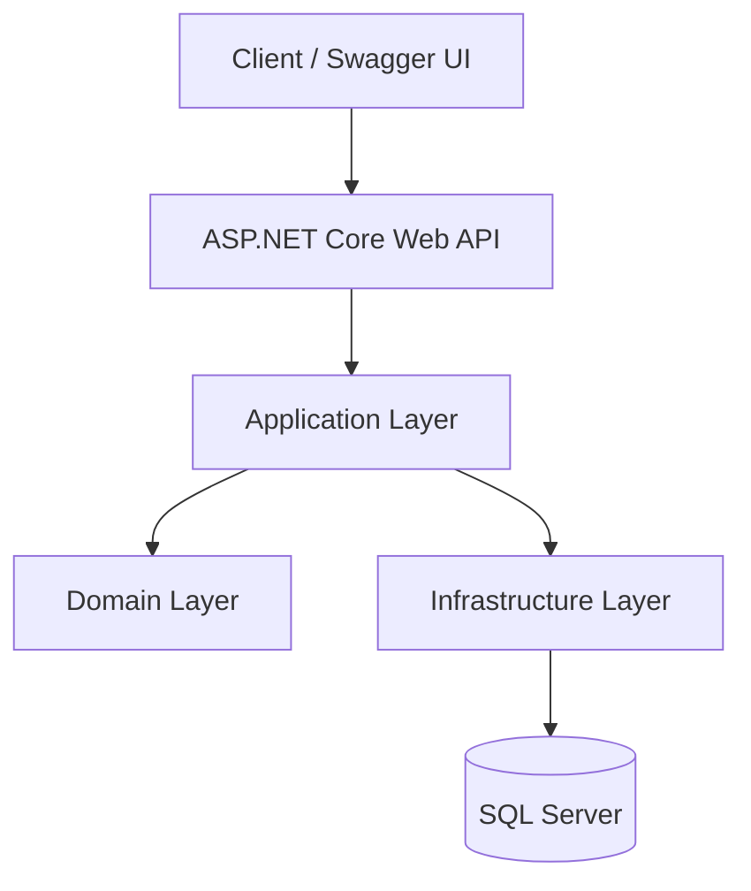
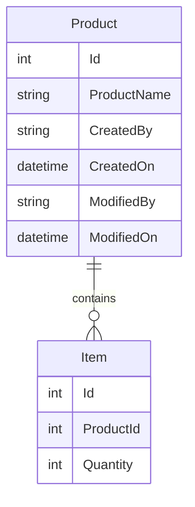

# Product Management API

RESTful backend API for Product CRUD operations, built as a CRN technical assessment solution using **.NET 8**, **Clean Architecture**, **JWT Authentication with Refresh Token Rotation**, and **Docker** deployment support.

---

# High-Level Architecture



| Layer | Responsibility |
|-------|----------------|
| **API** | HTTP endpoints, middleware, filters, authentication pipeline, Swagger |
| **Application** | Business logic, DTOs, Services, Validators, AutoMapper |
| **Domain** | Entities, domain models, custom exceptions |
| **Infrastructure** | EF Core, repositories, Unit of Work, Identity, database |

---

# Tech Stack

- .NET 8
- ASP.NET Core Web API
- Entity Framework Core
- SQL Server
- JWT Authentication
- Refresh Token Rotation
- AutoMapper
- FluentValidation
- Serilog
- Swagger / OpenAPI
- xUnit
- Moq
- WebApplicationFactory
- Docker
- Docker Compose

---

# Project Structure

```text
ProductManagement/
├── ProductManagementSolution/          # API
├── ProductManagement.Application/      # DTOs, Services, Validators
├── ProductManagement.Domain/           # Entities, Exceptions
├── ProductManagement.Infrastructure/   # EF Core, Repositories, Identity
├── ProductManagement.API.Tests/
├── ProductManagement.Application.Tests/
├── ProductManagement.Infrastructure.Tests/
└── docker-compose.yml
```

---

# Database Schema



---

# Global Exception Handling

The API uses custom middleware to return consistent error responses.

Handled Exceptions

- ValidationException → **400 Bad Request**
- UnauthorizedException → **401 Unauthorized**
- NotFoundException → **404 Not Found**
- Unhandled Exception → **500 Internal Server Error**

Example

```json
{
    "success": false,
    "statusCode": 404,
    "message": "Product with id 10 was not found."
}
```

---

# Validation

Request validation is implemented using **FluentValidation**.

Validators include:

- LoginRequestValidator
- CreateProductRequestValidator
- UpdateProductRequestValidator
- CreateItemRequestValidator
- UpdateItemRequestValidator

---

# Service Layer

Business logic resides inside the **Application Layer**.

Controllers never access the database directly.

```text
Client
   ↓
Controller
   ↓
Service
   ↓
Repository
   ↓
SQL Server
```

Responsibilities:

- Business rules
- Validation
- Mapping
- Repository coordination

---

# Repository Pattern

Entity Framework Core is abstracted through repositories.

Repositories implemented:

- ProductRepository
- ItemRepository
- RefreshTokenRepository

Benefits

- Loose coupling
- Easier unit testing
- Separation of concerns
- Clean Architecture compliance

---

# Authentication Flow

1. Login using **POST /api/v1/auth/login**
2. Credentials are validated.
3. API generates:
   - JWT Access Token
   - Refresh Token
4. Refresh Token is stored in SQL Server.
5. Protected APIs require:

```
Authorization: Bearer {accessToken}
```

6. When the JWT expires:

```
POST /api/v1/auth/refresh
```

returns

- New Access Token
- New Refresh Token

Old Refresh Token is revoked.

---

# API Endpoints

## Authentication

| Method | Endpoint | Authorization | Description |
|---------|----------|--------------|-------------|
| POST | `/api/v1/auth/login` | No | Login |
| POST | `/api/v1/auth/refresh` | No | Refresh Access Token |

---

## Product APIs

| Method | Endpoint | Authorization | Description |
|---------|----------|--------------|-------------|
| GET | `/api/v1/products` | Yes | Get paginated products |
| GET | `/api/v1/products/{id}` | Yes | Get product |
| POST | `/api/v1/products` | Admin | Create product |
| PUT | `/api/v1/products/{id}` | Admin | Update product |
| DELETE | `/api/v1/products/{id}` | Admin | Delete product |

---

## Item APIs

| Method | Endpoint | Authorization | Description |
|---------|----------|--------------|-------------|
| GET | `/api/v1/products/{productId}/items` | Yes | Get items by product |
| GET | `/api/v1/products/{productId}/items/{id}` | Yes | Get item |
| POST | `/api/v1/products/{productId}/items` | Admin | Create item |
| PUT | `/api/v1/products/{productId}/items/{id}` | Admin | Update item |
| DELETE | `/api/v1/products/{productId}/items/{id}` | Admin | Delete item |

---

# Pagination

Example

```
GET /api/v1/products?pageNumber=1&pageSize=10
```

---

# Error Response Format

```json
{
    "success": false,
    "statusCode": 404,
    "message": "Product with id 99 was not found."
}
```

---

# Environment Setup

## Prerequisites

- .NET 8 SDK
- SQL Server / LocalDB
- Docker Desktop (optional)

---

## Local Development

Clone repository

```bash
git clone <repository-url>
```

Apply migrations

```bash
dotnet ef database update --project ProductManagement.Infrastructure --startup-project ProductManagementSolution
```

Run API

```bash
dotnet run --project ProductManagementSolution
```

Swagger

```
https://localhost:7xxx/swagger
```

---

# Docker Deployment

Build

```bash
docker compose up --build
```

Containers

| Service | Port |
|----------|------|
| API | 8080 |
| SQL Server | 1433 |

Run migrations

```bash
dotnet ef database update --project ProductManagement.Infrastructure --startup-project ProductManagementSolution --connection "Server=localhost,1433;Database=ProductManagementDb;User Id=sa;Password=YourStrong@Passw0rd;TrustServerCertificate=True;"
```

---

# Testing

Run

```bash
dotnet test
```

Includes

- Application Tests
- Infrastructure Tests
- API Tests
- Integration Tests

---

# Security Features

- JWT Authentication
- Refresh Token Rotation
- Role-Based Authorization
- FluentValidation
- HTTPS Redirection
- CORS
- Security Headers
- Response Compression

---

# Performance Considerations

- AsNoTracking()
- Pagination
- Async/Await
- Repository Pattern
- Database Indexing
- EF Core Optimizations

---

# Configuration

Key configuration values stored inside **appsettings.json**

| Setting | Description |
|----------|-------------|
| ConnectionStrings:DefaultConnection | SQL Server connection |
| JwtSettings:Key | JWT signing key |
| JwtSettings:DurationInMinutes | Access token expiry |
| JwtSettings:RefreshTokenDurationInDays | Refresh token expiry |

---

# Demo Credentials

For assessment purposes only.

| Username | Password |
|----------|----------|
| admin | admin123 |

> **Note:** Authentication uses a demo administrator account configured in `appsettings.json`. In a production application, this would be replaced with ASP.NET Core Identity (or another identity provider) using securely hashed passwords stored in the database.

---

# Implementation Highlights

- Clean Architecture
- Repository Pattern
- Unit of Work
- API Versioning
- JWT Authentication
- Refresh Token Rotation
- FluentValidation
- AutoMapper
- Global Exception Middleware
- Serilog Structured Logging
- Swagger Documentation
- Docker Support
- Unit & Integration Testing

---

# License

This project was developed as part of the **CRN Technical Assessment** and is intended for evaluation purposes only.